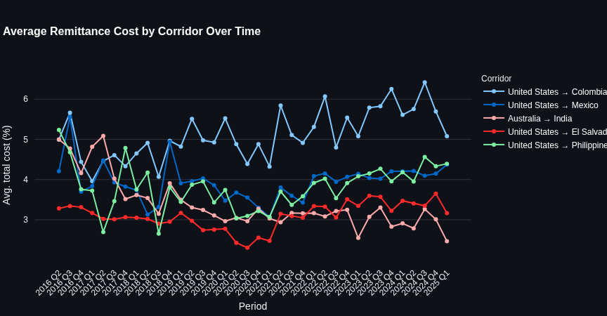
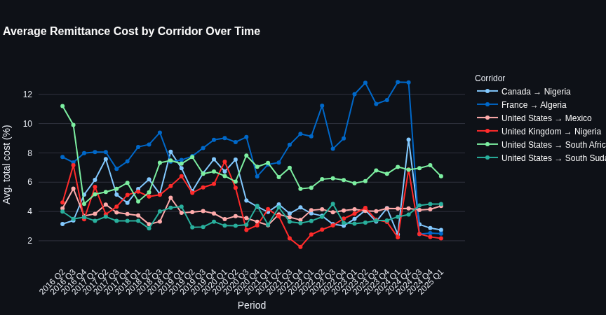
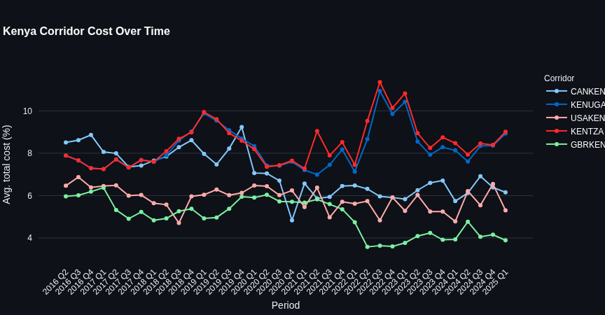
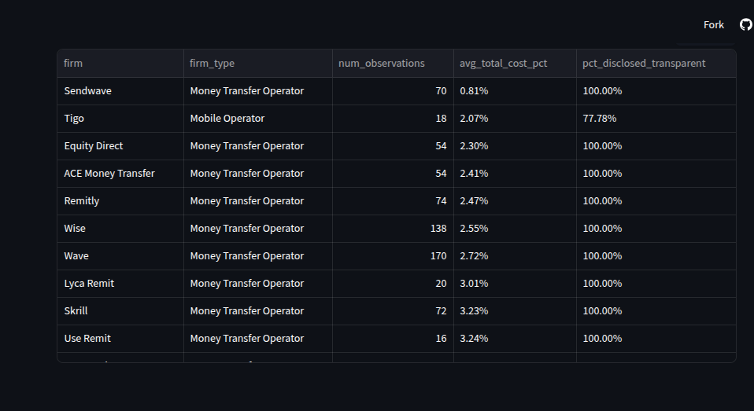
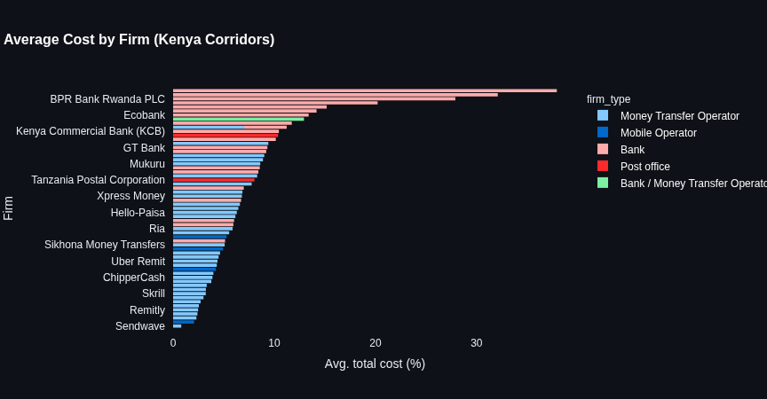

# Cross-Border Remittance Cost & Corridor Analytics

An end-to-end, cloud-native data engineering platform designed to ingest, process, transform, and analyze the World Bank’s **Remittance Prices Worldwide (RPW)** dataset. This platform models transfer costs across **350+ international remittance corridors**, uncovering hidden cost drivers, fee structures, and market dynamics—with a targeted analytical lens on Kenya’s remittance corridor landscape.

---

## Executive Summary & Key Insights

Remittances are a critical source of financial support for millions of households globally, yet pricing structures across financial institutions, money transfer operators (MTOs), and digital wallets remain opaque and fragmented.

This platform automates the ingestion of raw, multi-tier World Bank releases into an enterprise warehouse and interactive analytics engine, surfacing actionable cost metrics:

* **Bank vs. MTO/Mobile Pricing Disparity:** In Kenya’s inbound corridors, major commercial bank-published rates range **3x to 5x higher** than mobile money and MTO rates for identical transfer amounts—a disparity hidden without provider-level side-by-side decomposition.
* **Corridor Asymmetry (Kenya Spotlight):** Kenya acts predominantly as a high-density receiving market featuring **6 major inbound corridors served by 64 providers**, compared to **4 outbound corridors served by 21 providers**.
* **Data Transparency Scorecard:** ~98% of recorded observations provide full fee and foreign exchange (FX) disclosure. However, ~2% present hidden FX markups or discrepancies between reported total costs and underlying fee components.

---

## System Architecture

```text
World Bank RPW (.xlsx Quarterly Release)
                  │
                  ▼
   Apache Airflow DAG (S3 Drop Ingestion)
                  │
                  ▼
   AWS EMR Serverless (PySpark Processing & Quality Validation)
                  │
                  ▼
   AWS S3 Curated Zone (Partitioned Parquet by `quarter_label`)
                  │
                  ▼
   Snowflake RAW Zone (Idempotent Load via Stored Procedure)
                  │
                  ▼
   dbt Core (Staging ──► Intermediate ──► Analytics Marts)
                  │
                  ▼
   Streamlit & DuckDB Analytics Dashboard

```

### Infrastructure & CI/CD Governance

* **Infrastructure as Code (IaC):** Fully provisioned via **Terraform** (S3, ECR, IAM OIDC, EMR Serverless).
* **Zero-Trust Security:** Short-lived GitHub Actions OIDC authentication; keyless AWS interactions; RSA key-pair authentication for Snowflake.
* **Gated Delivery Pipelines:** GitHub Actions automates unit testing, SQL linting, and PySpark validation on Pull Requests. Production deployment (`main` branch) enforces gated manual approval before triggering `terraform apply`, ECR image updates, and production `dbt` runs.

---

## Technical Stack

| Domain | Technology / Tooling |
| --- | --- |
| **Infrastructure as Code** | Terraform, AWS IAM OIDC |
| **Compute & Processing** | AWS EMR Serverless (Spark 3.5 / EMR 7.1.0), PySpark, Docker |
| **Storage Layer** | AWS S3 (Raw Landing, Partitioned Curated) |
| **Data Warehousing** | Snowflake (Storage Integrations, Key-Pair Auth) |
| **Data Transformation** | dbt Core (Staging $\rightarrow$ Intermediate $\rightarrow$ Marts) |
| **Orchestration** | Apache Airflow 3.3.1 (Multi-container Docker Compose) |
| **Serving & Analytics** | Streamlit, Plotly, DuckDB (Isolated Mart Snapshot) |
| **CI/CD & DevOps** | GitHub Actions (Isolated CI environments & Gated CD) |

---

## Data Pipeline Design & Quality Controls

### 1. Ingestion & Spark Processing (EMR Serverless)

* **Dataset Scope:** ~198,000 raw records spanning 2016 Q2 through 2025 Q1 (314,846 records post-granularity deduplication).
* **Granularity Control:** Structural deduplication executed on composite grain (`raw_id` + `cc_number`) to differentiate $200 vs. $500 transfer tiers.
* **Quality Checks:** In-line validation flags FX margin consistency, transparency compliance, and structural duplicate detection without dropping records.
* **Target Partitioning:** Output written to AWS S3 in Parquet format partitioned by `quarter_label`.

### 2. Enterprise Warehousing (Snowflake)

* **Idempotent Loads:** Snowflake Stored Procedures execute an atomic `DELETE`-before-`COPY` operation per quarter, preventing duplicate record insertion during DAG backfills.
* **Secure Access:** Direct S3 integration using Snowflake Storage Integrations (no embedded secrets or keys).

### 3. Analytics Engineering (dbt Core)

* **Staging Layer:** Direct 1:1 typed abstractions over Snowflake `RAW` tables with normalized column naming.
* **Intermediate Layer:** Enriched models with currency, regional, and income classification reference seeds. Decomposes costs into base fees and FX margins.
* **Marts Layer:**
* `mart_corridor_cost_trends`: Longitudinal cost tracking by corridor and quarter.
* `mart_provider_comparison`: Firm-level comparison incorporating payment instruments and pickup mechanisms.
* `mart_transparency_flags`: Operational transparency and pricing consistency scorecards.
* `mart_kenya_corridors`: Tailored inbound vs. outbound analytics for Kenya.


* **Testing:** Fully covered with data tests verifying primary key uniqueness, referential integrity, non-null guarantees, and accepted values.

### 4. Orchestration & Monitoring (Apache Airflow)

* Orchestrates end-to-end dependencies: Ingestion $\rightarrow$ EMR PySpark Processing $\rightarrow$ Snowflake Warehouse Load $\rightarrow$ dbt Execution.
* Implements automated operational failure alerts via custom SMTP callbacks.

---

## Dashboard

Built with Streamlit and Plotly, backed by a self-contained DuckDB snapshot of the four dbt marts (not live Snowflake queries, to keep the deployed app dependency-light and fast).

### Global view

Multi-corridor cost trend comparison and a provider transparency scorecard across the full dataset.




### Kenya spotlight

Sending vs. receiving role toggle, cost trends, and firm-level comparison for Kenya's corridors.





---

## Key findings

- **Bank vs. MTO/mobile pricing gap:** in Kenya's inbound corridors, bank-published rates (major commercial banks) run 3-5x higher than mobile money and MTO rates for equivalent transfers.
- **Kenya's remittance profile:** a strong receiving market with heavy inbound competition — 6 corridors and 64 firms on the receiving side, versus 4 corridors and 21 firms sending, consistent with Kenya's real-world position.
- **Pricing transparency:** the large majority of observations (roughly 98 percent) are fully disclosed and internally consistent; a small but real minority (under 2 percent) show missing cost components or a mismatch between reported and decomposed total cost.

---

## Project Structure

```text
├── .github/workflows/    # CI/CD pipelines (Terraform, Docker, PySpark, dbt)
├── airflow/              # Airflow DAGs, Docker Compose, and SMTP callbacks
├── dashboard/            # Streamlit application & DuckDB database builder
├── dbt/                  # dbt models (staging, intermediate, marts), seeds, and tests
├── emr/                  # PySpark processing scripts and quality check modules
├── terraform/            # Infrastructure modules (S3, ECR, EMR, IAM OIDC)
└── requirements.txt      # Core Python dependency specifications

```

---

## Local Development Setup

### Prerequisites

* Python 3.12+
* Docker & Docker Compose
* AWS CLI configured with active SSO/credentials
* Snowflake Account with key-pair authentication configured
* Terraform CLI 1.5+

### Installation Steps

1. **Clone Repository & Set Up Virtual Environment:**
```bash
git clone https://github.com/Amon-Mugo/Cross-Border-Remittance-Cost-Corridor-Analytics.git
cd Cross-Border-Remittance-Cost-Corridor-Analytics
python3 -m venv .venv
source .venv/bin/activate
pip install -r requirements.txt

```


2. **Provision AWS Infrastructure:**
```bash
cd terraform
terraform init
terraform plan
terraform apply
cd ..

```


3. **Run dbt Transformations:**
```bash
cd dbt
dbt build --profiles-dir .
cd ..

```


4. **Launch Local Airflow Environment:**
```bash
docker compose up -d

```


5. **Run Streamlit Dashboard Locally:**
```bash
cd dashboard
streamlit run app.py

```


---

## Author

**Amon Mugo**

*Data Engineer | Cloud & DataOps*

* **GitHub:** [@Amon-Mugo]
* **Live Application:** [Remittance Analytics Dashboard]